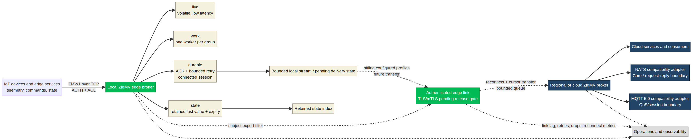

# zigmq / ZigMV

<p align="center">
  
</p>

<p align="center"><strong>One lightweight message protocol for services, IoT, and edge systems.</strong></p>

<p align="center">
  <a href="https://github.com/sudo-su-coffee/zigmq/actions/workflows/ci.yml"></a>
  <a href="https://github.com/sudo-su-coffee/zigmq/releases"></a>
  <a href="LICENSE"></a>
</p>

<p>
  <picture><source media="(prefers-color-scheme: dark)" srcset="https://shieldcn.dev/badge/Go.svg?variant=secondary&size=sm&logo=go&logoColor=00ADD8&mode=dark" /></picture>
  <picture><source media="(prefers-color-scheme: dark)" srcset="https://shieldcn.dev/badge/Firecracker.svg?variant=secondary&size=sm&logo=amazonaws&logoColor=FF9900&mode=dark" /></picture>
  <picture><source media="(prefers-color-scheme: dark)" srcset="https://shieldcn.dev/badge/SQLite.svg?variant=secondary&size=sm&logo=sqlite&logoColor=003B57&mode=dark" /></picture>
  <picture><source media="(prefers-color-scheme: dark)" srcset="https://shieldcn.dev/badge/gRPC.svg?variant=secondary&size=sm&logo=grpc&logoColor=6C4A9B&mode=dark" /></picture>
  <picture><source media="(prefers-color-scheme: dark)" srcset="https://shieldcn.dev/badge/Linux.svg?variant=secondary&size=sm&logo=linux&logoColor=FCC624&mode=dark" /></picture>
  <picture><source media="(prefers-color-scheme: dark)" srcset="https://shieldcn.dev/badge/AGPLv3.svg?variant=secondary&size=sm&logo=gnu&logoColor=A42E2B&mode=dark" /></picture>
</p>

**zigmq** is a small TCP message broker written in Zig. The `0.4.0` release introduces **ZigMV (Zig Message Protocol)** as the native unified protocol inspired by the useful parts of NATS and MQTT 5.0.

ZigMV uses one protocol and one message model for backend services, sensors, gateways, and edge applications. The native path provides live telemetry, work groups, durable delivery, and retained state without requiring separate client libraries. Existing custom, NATS-compatible, and MQTT-compatible listeners remain available as migration surfaces.

> The project is now preparing the `0.5.0` security and edge-transfer train. Native TLS/mTLS and remote edge-link transfer remain gated work; the currently implemented security foundation includes authentication, subject ACLs, subscription limits, and per-client publish rate limits.


## Why zigmq?

| Need | zigmq approach |
| --- | --- |
| Cloud service events | Fast publish/subscribe and request/reply patterns |
| IoT and edge devices | Small protocol, bounded resources, reconnect-friendly design |
| Work distribution | Consumer-group profile planned in the same message model |
| Durable messages | Optional local stream, ACKs, expiry, and bounded in-session redelivery |
| Simple deployment | One small binary, no external runtime dependency |
| Existing clients | Custom, NATS-compatible, and MQTT-compatible surfaces |
| Product boundary | Messaging only; `zigkv` remains the Redis-compatible data store |

## Install

### Download a beta binary

Open the [0.4.0 release](https://github.com/sudo-su-coffee/zigmq/releases/tag/v0.4.0) and download the archive for your platform when available.

### Build from source

Install [Zig 0.15.2](https://ziglang.org/download/) and clone the repository:

```sh
git clone https://github.com/sudo-su-coffee/zigmq.git
cd zigmq
zig build -Doptimize=ReleaseFast
```

The binary is created at `zig-out/bin/zigmq`.

## Quick start

Start the default custom-protocol server:

```sh
zig build run
```

The default listener is `127.0.0.1:4222`. To expose it on another address:

```sh
zig build run -- --host 0.0.0.0 --port 4222
```

Check the build version and help:

```sh
zig build run -- --version
zig build run -- --help
```

The current development train reports `zigmq 0.6.0` for the version command. This branch is an unreleased 0.6.0 observability and performance bundle; do not treat it as a published tag until its PR and CI gates pass.

## Native ZigMV

Start the native unified protocol:

```sh
zig build run -- --protocol zigmv --port 4222
```

ZigMV uses one canonical subject space and explicit delivery profiles:

| Profile | Current status | Intended use |
| --- | --- | --- |
| `live` | Implemented | Low-latency, volatile, at-most-once delivery |
| `work` | Implemented | One-of-N consumer-group delivery |
| `durable` | Implemented bounded foundation | Delivery IDs, ACKs, expiry, local stream append, and connected-session redelivery |
| `state` | Implemented foundation | Retained last-value device state |
| `exact` | Explicitly rejected | Reserved for proven deduplication and crash recovery |

Subscribe and publish with the current `live` profile:

```text
ZMV/1 SUB live sensors.room1.temperature\r\n
ZMV/1 OK SUB\r\n

ZMV/1 PUB live 1 sensors.room1.temperature 4\r\n
21.5\r\n
ZMV/1 OK PUB 1\r\n
```

ZigMV is specified in [`docs/ZIGMV_PROTOCOL.md`](docs/ZIGMV_PROTOCOL.md). Its routing design is called **Adaptive Delivery and Transfer (ADT)**: authenticate the connection, authorize the subject, match subscriptions once, then apply the selected delivery profile without a NATS-to-MQTT bridge in the hot path.

For a bounded native deployment, configure authentication and subject-level controls at startup:

```sh
zig build run -- --protocol zigmv --auth-token-file ./edge.token \\
  --publish-allow telemetry.* --subscribe-allow telemetry.* \\
  --publish-rate-limit 100
```

A client authenticates before using ZigMV operations:

```text
ZMV/1 AUTH edge-secret\r\n
ZMV/1 OK AUTH\r\n
```

### Native throughput benchmark

Run the sustained benchmark against a ReleaseFast binary:

```sh
zig build -Doptimize=ReleaseFast
./zig-out/bin/zigmq --protocol zigmv --port 4222
python3 scripts/benchmark_zigmv.py --port 4222 \\
  --duration 10 --target-mps 100000000 --payload-size 32 \\
  --drain-timeout 30
```

The benchmark reports the offered target, successfully written messages, broker-acknowledged messages when `--ack-publishes` is enabled, delivered messages, gaps, duplicates, invalid frames, loss, and backpressure events. A `100000000` target is an **offered-rate stress target**, not a guaranteed result. The benchmark passes only when accepted and delivered counts match with zero integrity errors. Use `--ack-publishes` when measuring broker-confirmed acceptance rather than merely bytes written to the publisher socket.

The client mailbox remains bounded. When a consumer cannot keep up, the broker applies producer backpressure instead of allowing unbounded memory growth. This makes the delivered-rate and loss fields more meaningful than a raw publisher loop rate.

## Existing protocol surfaces

The existing listeners are useful when integrating current applications:

| Protocol | Start command | Intended clients |
| --- | --- | --- |
| Custom | `zig build run -- --protocol custom` | zigmq examples and simple scripts |
| NATS-compatible | `zig build run -- --protocol nats` | Small NATS-style service clients |
| MQTT-compatible | `zig build run -- --protocol mqtt --port 1883` | MQTT device and gateway clients |
| ZigMV | `zig build run -- --protocol zigmv` | New unified cloud/IoT/edge clients |

The compatibility listeners are intentionally smaller than full NATS or MQTT 5.0 implementations. ZigMV is the native protocol direction; compatibility support is maintained separately so it does not make the core message path unnecessarily complex. ZigMV `live` is comparable to Core NATS or MQTT QoS 0. ZigMV `durable` currently provides ACK-tracked connected-session redelivery, similar in intent to an at-least-once path, but it is not full MQTT QoS 1 or NATS JetStream interoperability because durable client identity, reconnect resume, and persistent consumer cursors are not complete. MQTT QoS 2 and ZigMV `exact` are not implemented.

## Where ZigMV fits

ZigMV is useful when one deployment spans constrained devices, a local gateway, and cloud services, and the application needs to choose delivery behavior per message instead of adopting separate broker products. Use `live` for high-rate sensor telemetry where the newest reading matters more than replaying every sample; use `work` for commands or jobs that should be handled by one worker; use `durable` for important connected-session commands that must be acknowledged and retried; and use `state` for retained device status or configuration snapshots. `zigkv` remains the Redis-compatible key-value system, while ZigMV remains the messaging system.

ZigMV is different from NATS and MQTT rather than being a drop-in replacement. It takes NATS-like subjects, request/reply, and work sharing, then combines them with MQTT-like retained state, expiry, constrained-device orientation, and explicit delivery profiles. It uses one canonical ZigMV envelope and one routing core, so compatibility adapters are boundaries rather than separate hot-path brokers. The current implementation does not claim the full NATS JetStream feature set or MQTT 5.0 QoS 2; those require additional conformance and crash-recovery work.

### Edge-to-cloud flow



The local broker keeps volatile traffic close to devices, applies ACLs and bounded mailboxes, stores only configured durable/state data, and forwards selected subjects through a future authenticated edge link. The edge link design includes reconnect backoff, cursor transfer, bounded offline queues, lag, retry, and drop metrics, but native TLS/mTLS and remote offline transfer remain release gates rather than current guarantees.

## Custom protocol example

```text
SUB sensors.*\r\n
+OK SUB\r\n
PUB sensors.room1 21.5 C\r\n
+OK PUB\r\n
MSG sensors.room1 6\r\n
21.5 C\r\n
PING\r\n
PONG\r\n
```

The custom protocol uses `*` for one subject token and `>` for the remaining suffix. It also supports retained values, consumer groups, request/reply, authentication, and explicit stream replay.

## Durable local stream

Enable the optional append-only local stream:

```sh
zig build run -- --stream ./data/events.zmq
```

The stream is a local append-only log. It is useful for replay and experimentation, but the beta release does not claim replicated storage, consumer offsets, compaction, transactions, or exactly-once delivery.

## Authentication and limits

For a small trusted deployment, use a token file:

```sh
zig build run -- --auth-token-file ./data/zigmq.token
```

The beta has bounded resources to protect small edge systems: 1,024 clients, 1,024 subscriptions per client, eight unauthenticated commands, and bounded per-client queues. The current TCP transport is plaintext; put it behind a protected network or TLS-terminating proxy until native TLS is added.

## Tests

Run the Zig unit tests:

```sh
zig build test
```

Run the repository integration checks:

```sh
python3 scripts/e2e_test.py --binary ./zig-out/bin/zigmq
python3 scripts/edge_features_test.py --binary ./zig-out/bin/zigmq
python3 scripts/stream_test.py --binary ./zig-out/bin/zigmq
python3 scripts/cli_test.py --binary ./zig-out/bin/zigmq
python3 scripts/python_ffi_test.py
python3 scripts/security_hardening_test.py --binary ./zig-out/bin/zigmq
```

## Benchmarks

Start a native ZigMV server and measure the consolidated 0.6.0 live and acknowledged delivery paths:

```sh
zig build run -- --protocol zigmv --port 4222
python3 scripts/benchmark_zigmv.py --duration 10 --target-mps 35000 --payload-size 128 --ack-publishes
```

That command measures acknowledged publish throughput. For NATS-like one-way live telemetry, omit publisher acknowledgements:

```sh
python3 scripts/benchmark_zigmv.py --duration 10 --target-mps 35000 --payload-size 128 --allow-live-loss
```

The `live` profile is at-most-once. `--allow-live-loss` makes the harness report `PASS_LOSSY_LIVE` when broker acceptance and frame integrity are correct but overload causes delivery loss; it does not hide gaps, duplicates, or invalid frames. Use `--ack-publishes` for the strict lossless comparison. The harness synchronizes no-ACK runs with native `STATS` before publisher shutdown, so socket-written and broker-accepted counts are not conflated.

Run the matrix with payload sizes of 16, 128, and 1,024 bytes and subscriber counts of 1, 10, and 50. Record the commit, Zig version, optimization mode, CPU, memory, operating system, publish mode, publish rate, delivery rate, delivery ratio, and latency. Benchmark numbers are machine-specific and are not performance guarantees.

### Recorded benchmark evidence

The following values are real local benchmark artifacts stored under [`benchmark_runs/`](benchmark_runs/) and consolidated in [`docs/ZIGMV_BETA_RELEASE_GATES.md`](docs/ZIGMV_BETA_RELEASE_GATES.md). They are evidence for comparison and regression tracking, not universal capacity guarantees.

| Workload | Recorded result |
| --- | ---: |
| 0.6.0 live, 1,000 messages, 128-byte payload | **994/1,000 delivered; 99.4% delivery ratio; PASS_LOSSY_LIVE** |
| 0.6.0 acknowledged live, 1,000 messages, 128-byte payload | **1,000/1,000 delivered; 100% delivery ratio; PASS** |
| Publish ACK capacity | **23,563.4 msg/s** |
| 50-subscriber fan-out source rate | **1,781.3 msg/s** |
| 50-subscriber fan-out deliveries | **89,066.7 deliveries/s** |
| Volatile publish ACK without stream | **36,618.7 msg/s** |
| Publish ACK with local stream | **6,294.2 msg/s** |
| Stream relative rate | **17.2%** of the no-stream rate |
| Realtime telemetry | **20,424.8 msg/s** |
| Realtime alert burst | **18,253.4 events/s** |
| Realtime command-control | **2,731.1 commands/s** |
| Realtime consumer group | **882.4 msg/s** with three members |

The explicit 100M messages/sec run is an offered-rate stress target, not an achieved end-to-end guarantee. A valid lossless result must separately show accepted, delivered, and acknowledged counts with zero gaps, duplicates, invalid frames, and unexplained expiry.

## Try ZigMV

Start the native unified protocol listener:

```sh
zig build run -- --protocol zigmv --host 127.0.0.1 --port 4222
```

A live subscription and no-ack telemetry publish look like this:

```text
ZMV/1 SUB live sensors.room1.temperature
ZMV/1 PUB live - sensors.room1.temperature 4
21.5
```

A work group uses one shared group name. Each message is delivered to one eligible worker:

```text
ZMV/1 SUB work jobs.created workers
ZMV/1 PUB work 42 jobs.created 5
hello
```

The `0.6.0` development train carries the `live`, `work`, `durable`, and `state` profiles plus native STATS observability. `exact` remains disabled until deduplication and crash-recovery guarantees are complete.

## ZigMV direction

The next protocol generation is **ZigMV**: one lightweight message protocol and one Adaptive Delivery and Transfer algorithm for cloud services, IoT devices, and edge gateways. It combines NATS-like low-latency subjects, request/reply, and work sharing with MQTT-like device sessions, retained state, expiry, and stronger delivery profiles. It is a new protocol, not two protocol implementations joined by a bridge.

The `0.4.0` release combines the ZMV/1 foundation, `live`, `work`, durable delivery, ACK handling, durable stream append, retained state, expiry metadata, and the first persistent delivery state. The current follow-up work adds bounded in-session durable redelivery and stronger benchmark integrity accounting. Later trains must still add durable client identity and reconnect resume, native TLS/mTLS, authenticated edge transfer, full adapter conformance, exact-delivery deduplication, clustering, and final hardening before `1.0.0-beta`.

The project boundaries remain intentional. `zigkv` owns Redis-compatible data structures; `nammapush-rs` owns notification delivery and provider fallback; zigmq/ZigMV owns transport, routing, delivery state, and edge messaging.

Read the design first: [`docs/ZIGMV_PROTOCOL.md`](docs/ZIGMV_PROTOCOL.md).

## Documentation

| Document | Purpose |
| --- | --- |
| [`docs/GETTING_STARTED.md`](docs/GETTING_STARTED.md) | Short installation and first-message guide |
| [`docs/ZIGMV_PROTOCOL.md`](docs/ZIGMV_PROTOCOL.md) | ZigMV protocol, ADT algorithm, transfer model, and release gates |
| [`docs/ZIGMV_COMPARISON_FINDINGS.md`](docs/ZIGMV_COMPARISON_FINDINGS.md) | NATS and MQTT capability comparison and ZigMV implications |
| [`docs/ZIGMV_BENCHMARK_0.5.0.md`](docs/ZIGMV_BENCHMARK_0.5.0.md) | Reproducible 0.5.0 benchmark and validation evidence |
| [`docs/ZIGMV_EDGE_ARCHITECTURE.mmd`](docs/ZIGMV_EDGE_ARCHITECTURE.mmd) | Source flow diagram for device, edge, cloud, and compatibility paths |
| [`docs/ZIGMV_EDGE_ARCHITECTURE.png`](docs/ZIGMV_EDGE_ARCHITECTURE.png) | Rendered edge architecture diagram |
| [`docs/ZIGMV_RELEASE_PLAN.md`](docs/ZIGMV_RELEASE_PLAN.md) | ZigMV release gates and delivery-guarantee boundaries |
| [`docs/ZIGMV_BETA_RELEASE_GATES.md`](docs/ZIGMV_BETA_RELEASE_GATES.md) | Complete 0.5.0-to-1.0.0-beta implementation, benchmark, and release checklist |
| [`docs/ZIGMV_RELEASE_0.6.0.md`](docs/ZIGMV_RELEASE_0.6.0.md) | Unreleased 0.6.0 observability and performance bundle |
| [`docs/ZIGMV_ROADMAP.md`](docs/ZIGMV_ROADMAP.md) | Grouped release trains from 0.4.0 to 1.0.0-beta |
| [`docs/RELEASE_0.4.0.md`](docs/RELEASE_0.4.0.md) | Grouped 0.4.0 ZigMV release notes and guarantees |
| [`CHANGELOG.md`](CHANGELOG.md) | Version history |
| [`CONTRIBUTING.md`](CONTRIBUTING.md) | Contribution and test workflow |

## Project structure

```text
src/main.zig       broker, listeners, and ZigMV handlers
src/root.zig       shared limits, parser helpers, and version
src/zigmv_state.zig delivery state primitives and ACK tracking
scripts/            integration tests and benchmarks
docs/               protocol, release, and user documentation
assets/             project branding
```

## Contributing

Create a branch, make a focused change, run `zig build test`, run the relevant integration tests, and include benchmark evidence for performance changes. Please do not claim a delivery guarantee until restart, backpressure, duplicate, expiry, and failure behavior are tested.

```sh
git checkout -b feat/your-change
zig build test
git diff --check
git commit -m "feat: describe the change"
```

## License

See [`LICENSE`](LICENSE).
